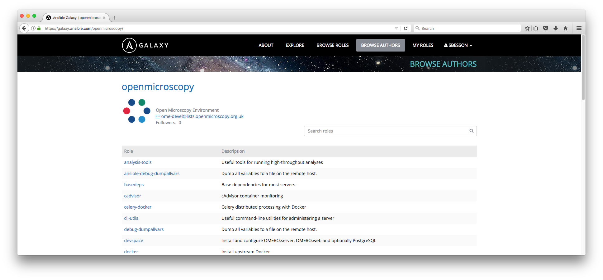

OME Ansible
===========

This folder contains a variety of Ansible playbooks, including example files for provisioning an OpenStack VM from scratch with OMERO using Ansible.
Most of these scripts should also work on other platforms, providing the VM is brought up by some other method.

- Playbooks which start with `os` are OpenStack specific - the `os` stands for `OpenStack`.
- Playbooks which start with `idr` are for the Image Data Repository.
- Playbooks which start with `ci` are for OME continuous integration and build.

To get started with a minimal OMERO server, see the example playbook in the [omero-server](https://github.com/openmicroscopy/ansible-role-omero-server) role.

For more explanation on using Ansible in general, you may want to read:

- [Getting started](../docs/ansible/installation.md): Installation docs and initial examples.
- [Ansible](../docs/ansible/ansible.md): Overview of Ansible, the configuration management system.
- [Example workflows](../docs/ansible/example_workflows.md): Examples of provisioning new hosts, and running Ansible playbooks.
- [Contributing](../docs/ansible/contributing.md): Suggestions on submitting modifications and extensions to the OME ansible roles and playbooks.

Roles
-----

Roles are "the Ansible way of bundling automation content and making it
reusable." To keep playbooks as simple as possible, logic is refactored out
into roles, maintaining in individual repositories and versioned separately. A
list of most of the roles can be found in
[ansible/requirements.yml](https://github.com/openmicroscopy/infrastructure/blob/master/ansible/requirements.yml).

### on Ansible Galaxy ###

Core roles can be found under the
[openmicroscopy](https://galaxy.ansible.com/openmicroscopy/) account on Galaxy
and are versioned using [Semantic Versioning](http://semver.org/). Roles which
version is below 1.0.0 should be considered in development.

Examples of production roles include:

 -  openmicroscopy.omero-server
    ([GitHub](https://github.com/openmicroscopy/ansible-role-omero-server)/([Galaxy](https://galaxy.ansible.com/openmicroscopy/omero-server/)): Install and configure OMERO.server, and optionally PostgreSQL

 -  openmicroscopy.omero-web
    ([GitHub](https://github.com/openmicroscopy/ansible-role-omero-web)/([Galaxy](https://galaxy.ansible.com/openmicroscopy/omero-web/)): Installs and configures OMERO.web and Nginx

### from the community ###

The OME community also provides roles. For example:

 - hajaalin.truststore
   ([GitHub](https://github.com/hajaalin/ansible-role-truststore)/([Galaxy](https://galaxy.ansible.com/hajaalin/truststore/)):
   Install JKS TrustStore

If you would like to share your roles with other OME users, please open a PR against this file on GitHub.

Playbooks
---------

### IDR Systems Infrastructure (`idrsystems-*`) ###

These playbooks are for maintaining the bare-metal infrastructure for most of the IDR work.
This primarily involves maintaining the servers and storage underlying the virtualisation platforms used for development and running of the actual IDR, and is inevitably tied to the hardware configurations of these servers as well as the configuration of other services provided by the parent institution.

- `idrsystems-deployment.yml`: Use this playbook for checking and enforcing consistency of all existing IDR infrastructure.
  This includes deploying new roles to existing servers, or modifying configurations.
  If nothing has changed in the repository or inventory there should be no changes when this playbook is run.
- `idrsystems-provision.yml`: Use this playbook for ensuring all servers are provisioned and up to date.
  This includes provisioning new servers, running system upgrades, and everything in `idrsystems-deployment.yml`.
  Since this attempts to install updates there may be changes even if the repository or inventory are unchanged.

### Dell Hardware (`hardware-dell`) ###

The playbooks in the `hardware-dell` directory can be used to help with installing Dell hardware maintenance, for instance DRAC and BIOS updates.
Given the nature of these updates these playbooks should only be run when required, and consideration given to running against one host at a time.
